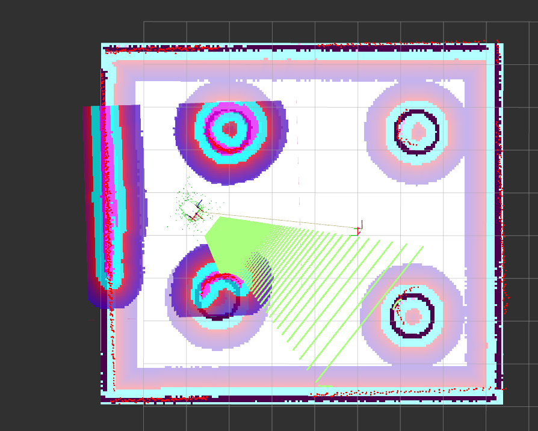

# Example of ROS 2 and Gazebo on pixi

## Introduction

This is an example package to use ROS 2 and Gazebo Ignition on [pixi](https://pixi.sh/latest/).



## Requirements

I checked on the following environment.

- macOS Sonoma 14.4
- pixi 0.45.0

## install pixi

```bash
curl -fsSL https://pixi.sh/install.sh | bash
```

## Create a Pixi workspace 

```bash
pixi init my_ros2_project -c robostack-staging -c conda-forge
cd my_ros2_project
```

## Add ROS 2 dependencies

```bash
pixi add ros-humble-desktop-full \
colcon-common-extensions \
"setuptools<=58.2.0" \
ros-humble-joint-state-publisher \
ros-humble-xacro \
ros-humble-ros-gz-bridge \
ros-humble-ros-gz \
ros-humble-ros-gz-sim \
ros-humble-ros-gz-image \
ros-humble-ros-gz-interfaces \
ros-humble-slam-toolbox \
ros-humble-nav2-bringup \
ros-humble-navigation2
```

## Build

```bash
mkdir src
cd src
git clone https://github.com/atinfinity/pixi_ros2_gazebo_example.git
cd ..
pixi run colcon build --symlink-install
```

Please add the following description to `pixi.toml`.

```toml
[activation]
scripts = ["install/setup.sh"]
```

## Navigation

### Launch Gazebo

```bash
pixi run ros2 launch megarover_samples_ros2 vmegarover_with_sample_world.launch.py
```

### Launch Navigation

```bash
pixi run ros2 launch megarover_samples_ros2 vmegarover_navigation.launch.py
```

## Limitation

### GUI

The GUI features of Gazebo Ignition doesn't work due to <https://github.com/gazebosim/gz-sim/issues/2848>.

### render_engine

I used `ogre` as `render_engine` in Gazebo world.

## Reference

- <https://pixi.sh/latest/#installation>
- <https://pixi.sh/latest/tutorials/ros2/>
