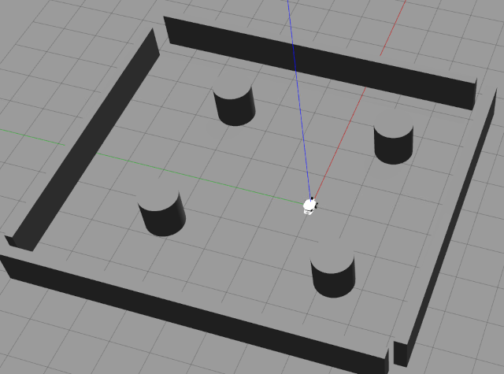
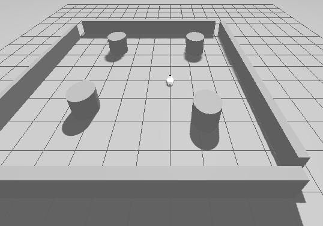
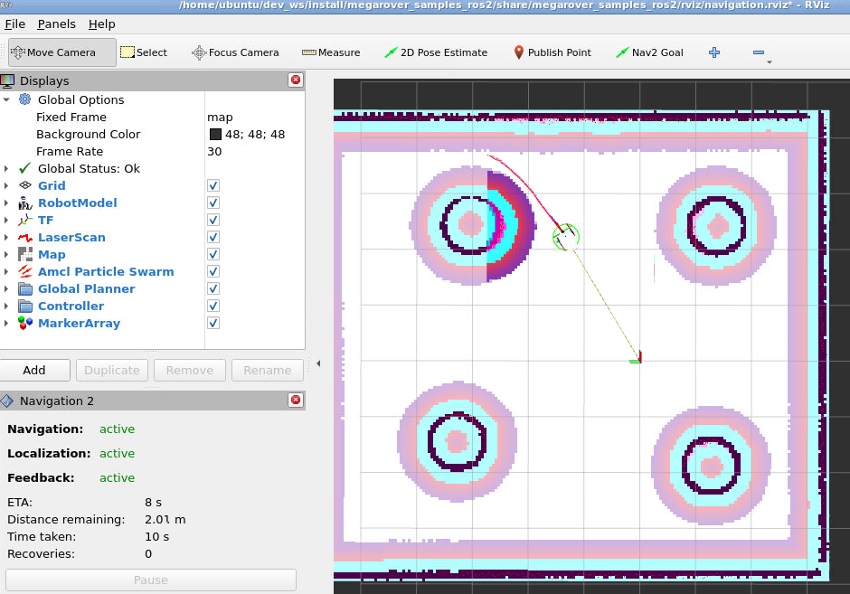

# megarover_samples_ros2

## Introduction

This is a ROS 2 Package to develop package of megarover using Gazebo.
I used model, mesh and world files of <https://github.com/vstoneofficial/megarover_samples> as a reference.

If you use ROS 2 Jazzy, please check [jazzy](https://github.com/atinfinity/megarover_samples_ros2/tree/jazzy) branch.

## Requirements

- ROS 2 Humble
- Classic Gazebo or Gazebo Fortress

And, I have tested with [Eclipse Cyclone DDS](https://github.com/eclipse-cyclonedds/cyclonedds) as RMW implementation.
If you use this RMW implementation, please install according to the following command.

```
sudo apt install ros-humble-rmw-cyclonedds-cpp
export RMW_IMPLEMENTATION=rmw_cyclonedds_cpp
```

## Build

```bash
mkdir -p ~/dev_ws/src
cd ~/dev_ws/src
git clone https://github.com/atinfinity/megarover_samples_ros2.git
cd ..
rosdep install -y -i --from-paths src/megarover_samples_ros2
colcon build --symlink-install
source ~/dev_ws/install/setup.bash
```

## Mapping

### Launch Gazebo

If you use headless mode, add the option `gui:=false`.

```bash
ros2 launch megarover_samples_ros2 vmegarover_with_sample_world.launch.py
```



NOTE (humble only):

In **humble**, gazebo_ros2_control can be activated. If you want to do activation with gazebo_ros2_control, add the option `use_ros2_control:=true`.
However, at this time, **gazebo_ros2_control and is still under development and unstable**.

```bash
ros2 launch megarover_samples_ros2 vmegarover_with_sample_world.launch.py use_ros2_control:=true
```

In addition, with `gazebo:=ignition` option, it is possible to start with an Ignition Gazebo.

```bash
ros2 launch megarover_samples_ros2 vmegarover_with_sample_world.launch.py gazebo:=ignition use_ros2_control:=true
```




### Launch Slam Toolbox for Mapping

```bash
ros2 launch megarover_samples_ros2 vmegarover_mapping.launch.py
```

### Launch Teleop

```bash
ros2 run teleop_twist_keyboard teleop_twist_keyboard
```

### Save Map

```bash
mkdir ~/maps
ros2 launch megarover_samples_ros2 vmegarover_save_map.launch.py
```

## Navigation

### Launch Gazebo

If you use headless mode, add the option `gui:=false`.

```bash
ros2 launch megarover_samples_ros2 vmegarover_with_sample_world.launch.py
```

### Launch Navigation

```bash
ros2 launch megarover_samples_ros2 vmegarover_navigation.launch.py map:=$HOME/maps/vmegarover_samplemap.yaml
```



## ToDo

- [x] 2D Scan
- [x] RGBD Camera
- [x] odometry
- [x] teleop
- [x] slam_toolbox
- [x] amcl
- [x] navigation
